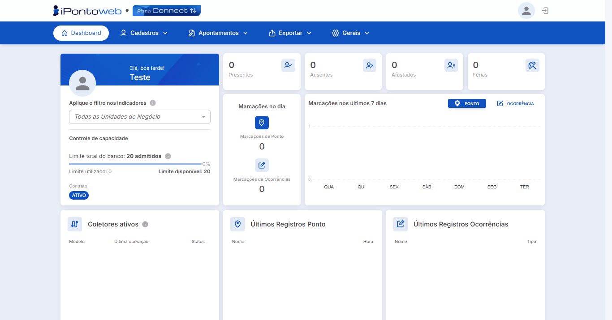

#  <b>Acessando o Sistema (Usuário Já Cadastrado)</b> 

Para acessar a plataforma do iPonto Web <b>já tendo feito o processo de registro</b>, siga com atenção os <b>passos abaixo</b>:

**Passo 1 - Acessar a Tela de Login**  
    Acesse a página de login do iPonto Web **<a href="https://ipontoweb.com.br/login/" target="_blank">Clicando Aqui</a>**, tendo em mãos as **credenciais de acesso** utilizadas anteriormente no **processo de registro**.
    

---

**Passo 2 - Inserir os Dados de Acesso**  
    No formulário exibido na tela, insira o **e-mail** e a **senha** utilzados durante o **processo de registro** da conta, e então clique no botão "**Acessar**" para continuar com o processo de login.
    

!!! tip "Dica"
    - Caso você tenha **esquecido** a sua **senha de acesso**, não se preocupe, você pode **recuperá-la** de forma rápida e fácil. Consulte o Passo a Passo [**Clicando Aqui!**](recuperacao_de_senha.md)

---

**Passo 3 - Confirmar o Acesso**  
    Após clicar em "**Acessar**", o sistema processará suas informações, e se tudo estiver correto, você será **redirecionado automaticamente** para a tela inicial da plataforma, finalizando assim, o **processo de login**.
    