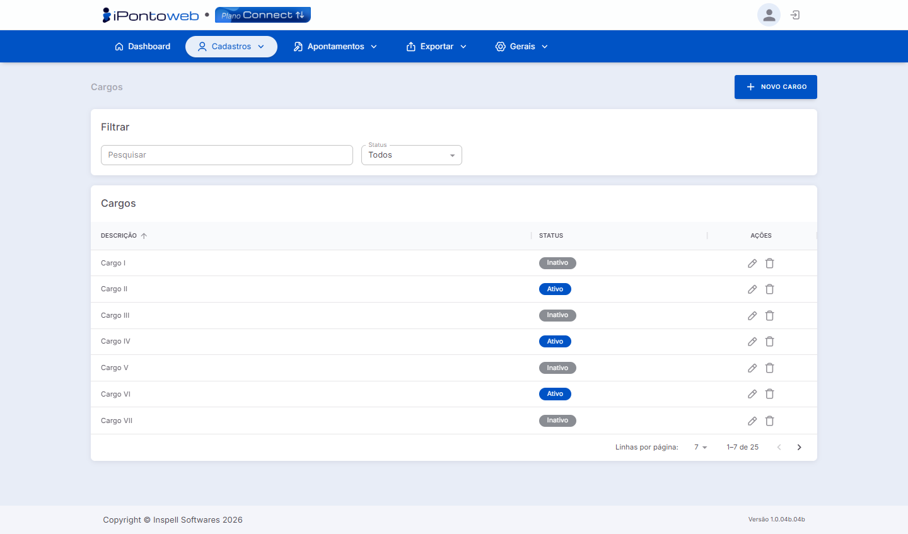

#  <b>Lista de Cargos Cadastrados</b> 

A Lista de Cargos exibe todos os cargos cadastrados na plataforma, permitindo gerenciar e organizar as funções dos colaboradores.

---

#  <b>Principais Recursos e Componentes da Tela</b> 

## **1 - Filtros de Seleção** 
### Permite localizar cargos específicos na listagem

<table class="tabela-config">
  <thead>
    <tr>
      <th>Campo</th>
      <th>Descrição</th>
    </tr>
  </thead>
  <tbody>
    <tr>  
      <td>Pesquisar</td>
      <td>Campo de busca para localizar um coletor específico, através da descrição.</td>
    </tr>
    <tr>  
      <td>Status</td>
      <td>Filtra os cargos por situação. As opções disponíveis são Todos, Ativo e Inativo</td>
        </tr>
  </tbody>
</table>

---

## **2 - Listagem de Cargos** 
### Exibe todos os cargos cadastrados na plataforma com as seguintes informações

<table class="tabela-config">
  <thead>
    <tr>
      <th>Campo</th>
      <th>Descrição</th>
    </tr>
  </thead>
  <tbody>
    <tr>  
      <td>Descrição</td>
      <td>Nome do cargo cadastrado. Permite ordenação clicando no cabeçalho</td>
    </tr>
    <tr>  
      <td>Status</td>
      <td>Situação atual do cargo — Ativo (Azul) ou Inativo (Cinza)</td>
    </tr>
    <tr class="secao">
      <td colspan="2">Ações</td>
    </tr>
    <tr>  
      <td>✏️ Editar</td>
      <td>Abre o cadastro do Cargo para edição</td>
    </tr>
    <tr>  
      <td>🗑️ Excluir</td>
      <td>Remove o Cargo do sistema</td>
    </tr>
  </tbody>
</table>

---

!!! warning "Observações Importantes"
    - O sistema só permite **excluir cargos** que **NÂO** estejam vinculados com algum colaborador.
    - Para evitar **inconsistências**, o sistema **NÂO** permite incluir dois ou mais cargos com o **mesmo nome**.
    - Caso você encontre **algum problema** durante o processo, não hesite em **buscar ajuda** com a nossa **equipe de suporte!**