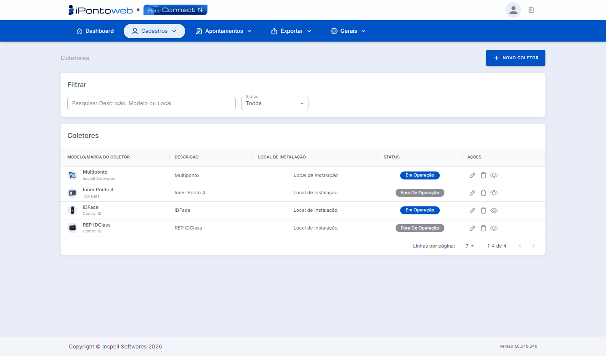

#  <b>Lista de Coletores Cadastrados</b> 

A <b>Lista de Coletores</b> exibe a listagem de todos os <b>equipamentos cadastrados</b> na plataforma, estejam fora de operação ou não, permitindo <b>visualizar</b>, <b>gerenciar</b> e realizar <b>ações</b> sobre cada registro, e monitorar cada dispositivo.

---

#  <b>Principais Recursos e Componentes da Tela</b> 

## **1 - Filtros de Seleção** 
### Permite localizar coletores específicos na listagem

<table class="tabela-config">
  <thead>
    <tr>
      <th>Campo</th>
      <th>Descrição</th>
    </tr>
  </thead>
  <tbody>
    <tr>  
      <td>Pesquisar</td>
      <td>Campo de busca para localizar um coletor específico, através da descrição, modelo ou local de instalação</td>
    </tr>
    <tr>  
      <td>Status</td>
      <td>Filtra os coletores por situação. As opções disponíveis são Todos, Em Operação e Fora de Operação</td>
        </tr>
  </tbody>
</table>

---

## **2 - Listagem de Coletores** 
### A tabela exibe as seguintes informações para cada equipamento cadastrado:

<table class="tabela-config">
  <thead>
    <tr>
      <th>Campo</th>
      <th>Descrição</th>
    </tr>
  </thead>
  <tbody>
    <tr>  
      <td>Modelo / Marca do Coletor</td>
      <td>Imagem, nome do modelo e fabricante do equipamento</td>
    </tr>
    <tr>  
      <td>Descrição</td>
      <td>Nome de identificação do coletor no sistema</td>
    </tr>
    <tr>  
      <td>Local de Instalação</td>
      <td>Local onde o iGateway (agente de comunicação) está instalado</td>
    </tr>
    <tr>  
      <td>Status</td>
      <td>Situação atual do coletor, indicada por um badge: Em Operação (Azul) ou Fora de Operação (Cinza)</td>
    </tr>
    <tr class="secao">
      <td colspan="2">Ações</td>
    </tr>
    <tr>  
      <td>✏️ Editar</td>
      <td>Abre o cadastro do coletor para edição</td>
    </tr>
    <tr>  
      <td>🗑️ Excluir</td>
      <td>Remove o coletor do sistema</td>
    </tr>
    <tr>  
      <td>👁️ Visualizar</td>
      <td>Exibe os detalhes do coletor em modo leitura</td>
    </tr>
  </tbody>
</table>

---

!!! warning "Observações Importantes"
    - O sistema só permite **excluir coletores** que **NÂO** possuam **marcações de ponto** vinculadas a ele. ❌
    - Caso você encontre **algum problema** durante o processo, não hesite em **buscar ajuda** com a nossa **equipe de suporte!** 😃

!!! tip "Dica"
    - Alguns equipamentos integrados com o **iPonto Web** necessitam do nosso **Agente de Comunicação** instalado na máquina para realizar a conexão.  **<a href="https://inspell.com.br/downloads/iponto/iGateway.exe" target="_blank">Para Baixar o Instalador do iGateway, Clique Aqui!</a>**