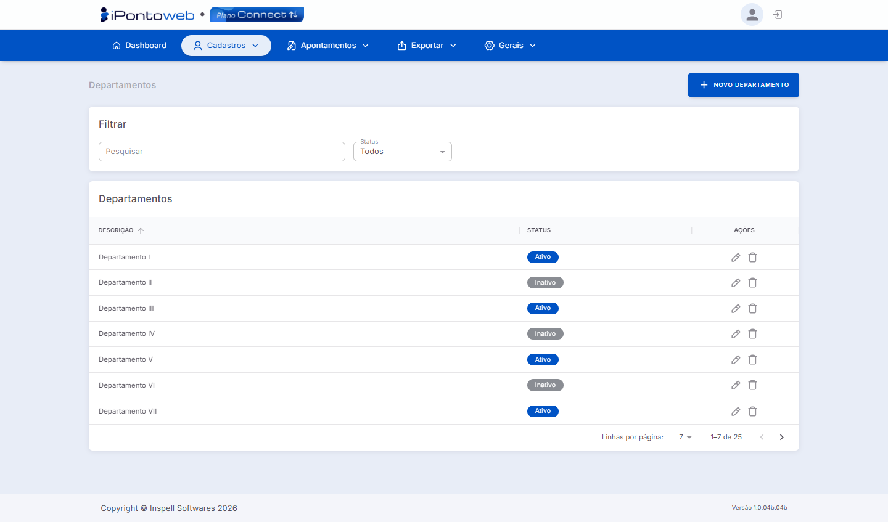

#  <b>Lista de Departamentos Cadastrados</b> 

A Lista de Departamentos exibe todos os departamentos cadastrados na plataforma, permitindo gerenciar e organizar as unidades de trabalho dos colaboradores.

---

#  <b>Principais Recursos e Componentes da Tela</b> 

## **1 - Filtros de Seleção** 
### Permite localizar cargos específicos na listagem

<table class="tabela-config">
  <thead>
    <tr>
      <th>Campo</th>
      <th>Descrição</th>
    </tr>
  </thead>
  <tbody>
    <tr>  
      <td>Pesquisar</td>
      <td>Campo de busca para localizar um departamento específico, através da descrição.</td>
    </tr>
    <tr>  
      <td>Status</td>
      <td>Filtra os cargos por situação. As opções disponíveis são Todos, Ativo e Inativo</td>
        </tr>
  </tbody>
</table>

---

## **2 - Listagem de Departamentos** 
### Exibe todos os departamentos cadastrados na plataforma com as seguintes informações

<table class="tabela-config">
  <thead>
    <tr>
      <th>Campo</th>
      <th>Descrição</th>
    </tr>
  </thead>
  <tbody>
    <tr>  
      <td>Descrição</td>
      <td>Nome do departamento cadastrado. Permite ordenação clicando no cabeçalho da coluna</td>
    </tr>
    <tr>  
      <td>Status</td>
      <td>Situação atual do registro: Ativo (Azul) ou Inativo (Cinza)</td>
    </tr>
    <tr class="secao">
      <td colspan="2">Ações</td>
    </tr>
    <tr>  
      <td>✏️ Editar</td>
      <td>Abre o cadastro do Departamento para edição</td>
    </tr>
    <tr>  
      <td>🗑️ Excluir</td>
      <td>Remove o registro do Departamento do sistema</td>
    </tr>
  </tbody>
</table>

---

!!! warning "Observação Importante"
    - O sistema só permite **excluir departamentos** que **NÂO** estejam vinculados com algum colaborador.