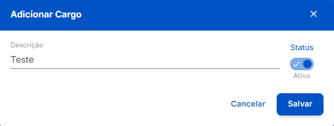

#  <b>Tela de Cadastro de Cargos</b> 

O **Cadastro de Cargo** é realizado rapidamente através de um **Modal Simples**, exibido ao clicar no botão **+ Novo Cargo** exibido na tela de listagem de cargos.

## **Modal de Cadastro** 

### Descrição dos Recursos e Componentes do Modal

<table class="tabela-config">
  <thead>
    <tr>
      <th>Campo</th>
      <th>Descrição</th>
    </tr>
  </thead>

  <tbody>
    <tr>  
      <td>Descrição</td>
      <td>Nome do cargo a ser cadastrado</td>
    </tr>
    <tr>  
      <td>Status</td>
      <td>Define se o cargo está Ativo ou Inativo. Habilitado por padrão</td>
    </tr>
  </tbody>
</table>

Após **preencher os campos**, clique em **Salvar** para confirmar o cadastro, ou em **Cancelar** para fechar o modal sem salvar as alterações.