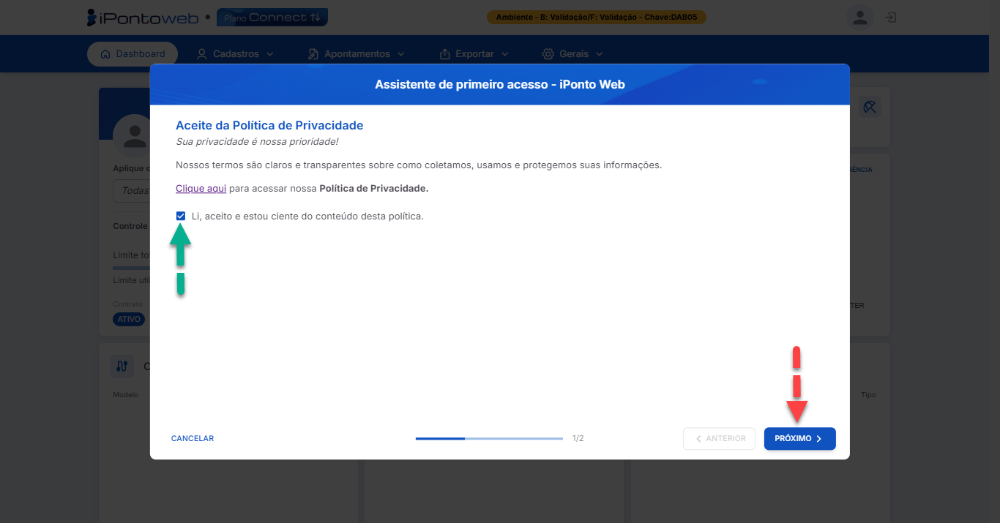
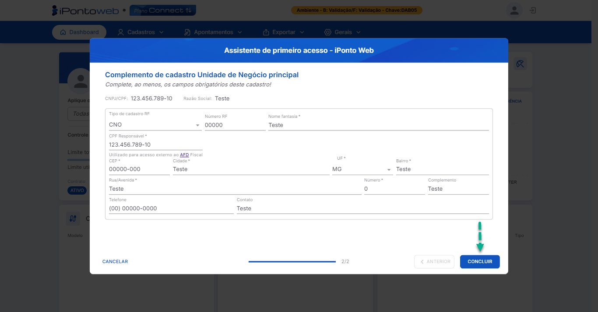

#  <b>Registro na Plataforma</b> 

---

## **Aplicação**

&nbsp;&nbsp;&nbsp;&nbsp;Através desse processo, o usuário realiza o **registro da sua conta** no iPonto Web, utilizando os **dados de acesso** recebidos através do e-mail de boas-vindas enviado pela nossa plataforma, e tem acesso às **principais funcionalidades** oferecidas pelo sistema.

---

## **Requisitos**

&nbsp;&nbsp;&nbsp;&nbsp;Para **se registrar** no sistema, é necessário ter:

- Um **contrato** do iPonto Web **ativo**.
- A **Chave de Acesso**, o **CNPJ** / **CPF** e o **E-mail** recebidos na mensagem de boas-vindas.

---

## **Execução**

- Acesse o **link oficial** de cadastro no iPonto Web **<a href="https://ipontoweb.com.br/registro/." target="_blank">Clicando Aqui</a>**. 
    <figure markdown>
        
        <figcaption>Interface de Acesso ao Sistema - Tela de Registro</figcaption>
    </figure>
    

---

- No **formulário de registro**, insira as informações solicitadas (**Chave de Acesso**, **CPF/CNPJ** e **E-mail**) conforme constam nos dados recebidos por **e-mail**. Para a senha, lembre-se de escolher uma **senha segura**, de sua preferência. Com os campos preenchidos, clique no botão "**Confirmar e Acessar**" para continuar com o processo de registro. 
    <figure markdown>
        
        <figcaption>Interface de Acesso ao Sistema - Tela de Registro Com Dados Preenchidos</figcaption>
    </figure>
    
!!! danger "Atenção:"
    Para garantir que você escolha uma senha **segura**, recomendamos que ela **tenha** entre **6** e **20** caracteres, pelo menos **1** letra **maiúscula**, **1** letra **minúscula**, **1** número e **1** caracter especial (permitido o uso de **. = + - ? ! @ # $ % ***).:

<!-- !!! danger "Atenção:"
    Caso o sistema retorne alguma **mensagem de erro** durante a tentativa de **login**, você pode **proceder** da seguinte forma:

    - **Erro 400 - Esta Chave de Acesso Já Está em Uso:** Indica que a **chave** inserida no formulário já está vinculada com **outra conta**. Verifique se você, ou alguém da sua equipe já realizou o **processo de registro** anteriormente. Caso sim, consulte o **passo a passo** de como fazer ***login*** no sistema **<a href="https://ipontoweb.com.br/login/." target="_blank">Clicando Aqui</a>**.
    - **Erro 400 - Cliente não disponível com essa chave:** Indica que o sistema não encontrou **nenhuma conta** viculada à chave inserida no formulário. Verifique se você digitou **corretamente** a Chave de Acesso.
    - **Erro 400 - E-mail não está vinculado à essa chave:** Indica que o e-mail e a chave de acesso informados no formulário **não estão vinculados**. Verifique se você inseriu ambos **corretamente**, seguindo as informações fornecidas no **e-mail de boas-vindas**.
    - **Erro 400 - Este e-mail já está em uso:** Indica que o e-mail inserido no formulário já está vinculado a **outra conta** do iPonto Web. Além de verificar se você inseriu **corretamente** o e-mail no campo, certifique-se também de** conferir** se você, ou alguém da sua equipe já realizou o **processo de registro** anteriormente utilizando este e-mail.
    - **Erro 400 - CPF / CNPJ não está vinculado a essa chave:** Indica que o Chave de Acesso e o CPF ou CNPJ inseridos no formulário **não estão vinculados**. Verifique se você inseriu ambos **corretamente**, seguindo as informações fornecidas no **e-mail de boas-vindas**.
    - **Erro 400 - Email Must Be A Email:** Indica que o e-mail inserido no formulário **não** é um e-mail **válido**. Certifique-se de inserir um e-mail no formato correto (Ex.: **nome@provedor.com**, **nome@provedor.com.br**, **nome@provedor.org.br**)
    - **Erro 504 - Problemas com a Conexão:** Verifique a **conexão de internet** da sua máquina, e se não há alguma **restrição de rede** (**Firewall**, **Proxy**, etc.) impedindo o acesso ao iPonto Web. Caso o problema persita, há possibilidade de ser um **erro interno** da plataforma, portanto, recomendamos contatar a nossa **equipe de suporte**. -->
---

- Após clicar em "**Confirmar e Acessar**", o sistema processará suas informações. Uma vez **concluído com sucesso**, você será redirecionado automaticamente para a **tela de boas-vindas do sistema**, que mostrará um resumo dos próximos passos do **assistente de primeiro acesso**. Para continuar com o processo de registro, clique no botão "**Iniciar**"
    <figure markdown>
        
        <figcaption>Assitente de Primeiro Acesso - Tela de Boas Vindas</figcaption>
    </figure>
    
---

- Nessa tela, leia o **conteúdo da nossa política**, para entender e compreender como iremos manipular com **segurança** os seus dados e informações. Em seguida, marque o checkbox da opção "**Li, aceito e estou ciente do conteúdo desta política**", para aceitar os nossos termos, e clique no botão "**Próximo**" para prosseguir com o processo de registro.
    <figure markdown>
        
        <figcaption>Assitente de Primeiro Acesso - Tela de Aceite da Política de Privacidade</figcaption>
    </figure>

---

- Caso a senha definida no momento do cadastro não seja **segura o suficiente**, o sistema exibirá uma página solicitando a criação de uma **nova senha** para proteger suas informações.
    Crie uma nova senha seguindo as **orientações de segurança** fornecidas na tela e então clique no botão "**Próximo**" para prosseguir para a última etapa do processo de regsitro.
    <figure markdown>
        
        <figcaption>Assitente de Primeiro Acesso - Tela de Troca de Senha</figcaption>
    </figure>
    
---

- Insira no formulário exibido na tela os dados referentes à **Unidade de Negócio Principal** que será utilizada no sistema,, se atentando aos **campos obrigatórios**.
    Por fim, clique no botão "**Concluir**", e o sistema te redicionará automaticamente para o **Painel Inicial da Plataforma (Dashboard)**, finalizando assim, o seu processo de registro.
    <figure markdown>
        
        <figcaption>Assitente de Primeiro Acesso - Tela de Cadastro da UN</figcaption>
    </figure>
    
---

!!! note "Informações"
    - Caso você decida **interromper o processo de registro** durante o assistente de primeiro acesso, não se preocupe, você pode **retomá-lo a qualquer momento**, *logando* novamente no sistema.
    - Caso você encontre **algum problema** durante o processo, não hesite em **buscar ajuda** com a nossa **equipe de suporte!**