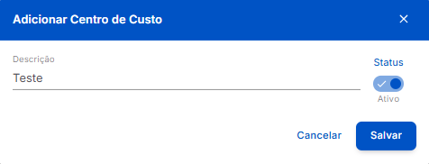

#  <b>Modal de Cadastro de Centros de Custo</b> 

---

## **Aplicação**

&nbsp;&nbsp;&nbsp;&nbsp; O **Cadastro de Centro de Custo** é realizado rapidamente através do seguinte **Modal Simples**, exibido ao clicar no botão **+ Novo Centro de Custo** exibido na Página de **Listagem**.

---

## **Modal de Cadastro**

<figure markdown>
  
  <figcaption>Interface de Cadastro de Centros de Custo - Modal</figcaption>
</figure>

- *Descrição:* Indica a **descrição** do centro de custo, utilizada para **identificação** na lista. É inserida durante o **cadastro** do centro de custo.
- *Status:* Indica o **status** do centro de custo após o **cadastro**:
    -  ➡ Centro de Custo **Ativo**.
    -  ➡ Centro de Custo **Inativo**.
- *Botão* Cancelar ➡ Interrompe o processo de **cadastro**, descarta qualquer **modificação** e fecha o **modal**.
- *Botão* Salvar ➡ Finaliza o **cadastro** do centro de custo, grava as **modificações** realizadas, e fecha o **modal**.

!!! note "Informações"
    - O iPonto Web é um sistema ***Case Sensitive***, ou seja, que difere letras **maiúsculas** de **minúsculas**. Logo, as expressões "**TESTE**", "**Teste**" e "**teste**" são diferentes na visão da plataforma e podem existir **simultâneamente**.