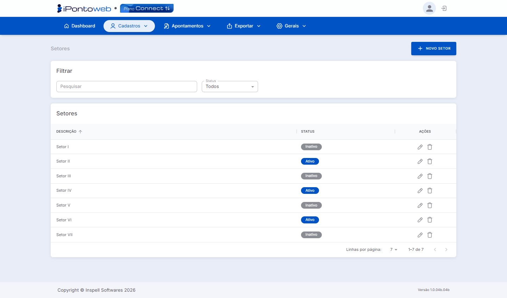

#  <b>Página de Setores Cadastrados</b> 

---

## **Aplicação**

&nbsp;&nbsp;&nbsp;&nbsp;A <b>Página de Setores</b> exibe a listagem de todos os <b>registros cadastrados</b> na plataforma, ativos ou inativos, permitindo <b>gerenciar</b> e realizar <b>ações</b> sobre cada registro.

---

## **Utilização**

&nbsp;&nbsp;&nbsp;&nbsp;A tela dispõe das seguintes **opções** para uso:

- *Botão* + Novo Setor ➡ Abre a tela de cadastro de um **novo setor**, permitindo **editar** suas informações e **adicioná-lo** ao sistema.
- *Filtros de Seleção:* Permite **filtrar** os registros da tabela com base nos seguintes **métodos**:
    - *Pesquisar:* Busca os registros na **tabela** com base no texto inserido no **campo**. Filtra apenas o conteúdo da coluna **Descrição**.
    - *Status:* Filtra a tabela com base no **status** atual do setor (**Ativo** e **Inativo**.)
- *Tabela de Setores Cadastrados:* Exibe, através de **3** colunas, informações **importantes** sobre cada **setor** registrado no sistema, além de um menu de **ações** para **gerenciar** cada cadastro:
    - *Descrição:* Exibe a **descrição** do setor, utilizada para **identificação** na lista. É inserida durante o **cadastro** do setor.
    - *Status:* Indica o atual **status** do setor, ou seja, se ele está Ativo ou Inativo
    - *Ações:* Exibe um **grupo de ações** que são utilizadas para gerenciar cada cadastro:
        - 🖊 ➡ Abre a tela de **edição** do setor, permitindo alterar sua **descrição** e o seu **status**.
        - 🗑 ➡ Exclui **permanentemente** o registro do setor do sistema.

!!! note "Informações"
    - O sistema só permite **excluir setores** que **NÂO** estejam vinculados com algum colaborador.
    - Para evitar **inconsistências**, o sistema **NÂO** permite incluir dois ou mais setores com exatamente o **mesmo nome**.