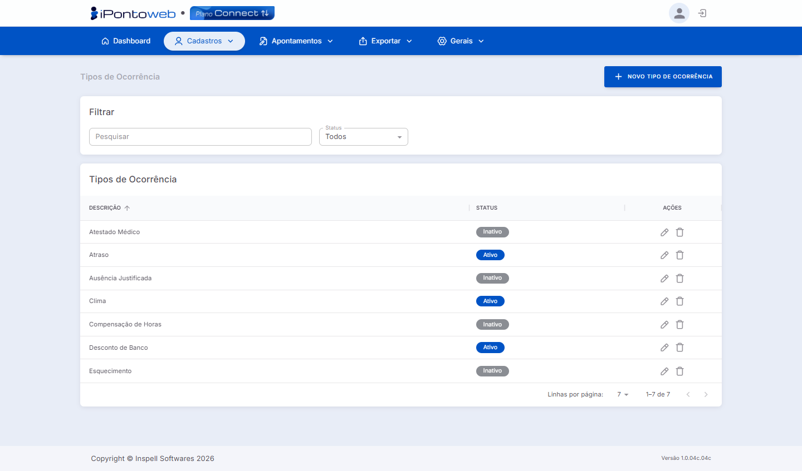

#  <b>Lista de Tipos de Ocorrência Cadastrados</b> 

A tela de Tipos de Ocorrência exibe todas as categorias de ocorrência cadastradas na plataforma, utilizadas para classificaar registros e justificativas de ponto dos colaboradores.

---

#  <b>Principais Recursos e Componentes da Tela</b> 

## **1 - Filtros de Seleção** 
### Permite localizar um tipo de ocorrência específico na listagem

<table class="tabela-config">
  <thead>
    <tr>
      <th>Campo</th>
      <th>Descrição</th>
    </tr>
  </thead>
  <tbody>
    <tr>  
      <td>Pesquisar</td>
      <td>Campo de busca para localizar um tipo de ocorrência específico, através da descrição.</td>
    </tr>
    <tr>  
      <td>Status</td>
      <td>Filtra os tipos de ocorrência por situação através das opções Todos, Ativo e Inativo</td>
        </tr>
  </tbody>
</table>

---

## **2 - Listagem de Registros (Tabela)** 
### Exibe todos os Tipos de Ocorrência cadastrados na plataforma com as seguintes informações

<table class="tabela-config">
  <thead>
    <tr>
      <th>Campo</th>
      <th>Descrição</th>
    </tr>
  </thead>
  <tbody>
    <tr>  
      <td>Descrição</td>
      <td>Nome do tipo de ocorrência cadastrado. Permite ordenação clicando no cabeçalho da coluna</td>
    </tr>
    <tr>  
      <td>Status</td>
      <td>Situação atual do registro: Ativo (Azul) ou Inativo (Cinza)</td>
    </tr>
    <tr class="secao">
      <td colspan="2">Ações</td>
    </tr>
    <tr>  
      <td>✏️ Editar</td>
      <td>Abre o registro do tipo de ocorrência para edição</td>
    </tr>
    <tr>  
      <td>🗑️ Excluir</td>
      <td>Remove o tipo de ocorrência selecionado do sistema</td>
    </tr>
  </tbody>
</table>

---

!!! danger "Atenção!"
    O sistema só permite **excluir um tipo de ocorrência** que ainda **NÂO** foi utilizado por algum colaborador.

!!! note "Informação"
    Os **Tipos de Ocorrência** cadastrados nessa lista podem ser **utilizados pelos seus colaboradores** no nosso APP **iPonto Mobile**. Caso não o conheça ainda, **<a href="https://www.inspell.com.br/ipontomobile/" target="_blank">Clique Aqui</a>** e saiba mais!