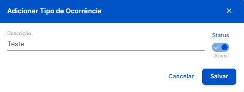

#  <b>Modal de Cadastro de Tipos de Ocorrência</b> 

---

## **Aplicação**

&nbsp;&nbsp;&nbsp;&nbsp; O **Cadastro de Tipo de Ocorrência** é realizado rapidamente através do seguinte **Modal Simples**, exibido ao clicar no botão **+ Novo Tipo de Ocorrência** exibido na Página de **Listagem**.

---

## **Modal de Cadastro**

<figure markdown>
  
  <figcaption>Interface de Cadastro de Tipos de Ocorrência - Modal</figcaption>
</figure>

- *Descrição:* Indica a **descrição** do tipo de ocorrência, utilizada para **identificação** na lista. É inserida durante o **cadastro** do tipo de ocorrência.
- *Status:* Indica o **status** do tipo de ocorrência após o **cadastro**:
    -  ➡ Tipo de Ocorrência **Ativo**.
    -  ➡ Tipo de Ocorrência **Inativo**.
- *Botão* Cancelar ➡ Interrompe o processo de **cadastro**, descarta qualquer **modificação** e fecha o **modal**.
- *Botão* Salvar ➡ Finaliza o **cadastro** do setor, grava as **modificações** realizadas, e fecha o **modal**.

!!! note "Informações"
    - O iPonto Web é um sistema ***Case Sensitive***, ou seja, que difere letras **maiúsculas** de **minúsculas**. Logo, as expressões "**TESTE**", "**Teste**" e "**teste**" são diferentes na **visão** da plataforma e **podem** existir **simultâneamente**.