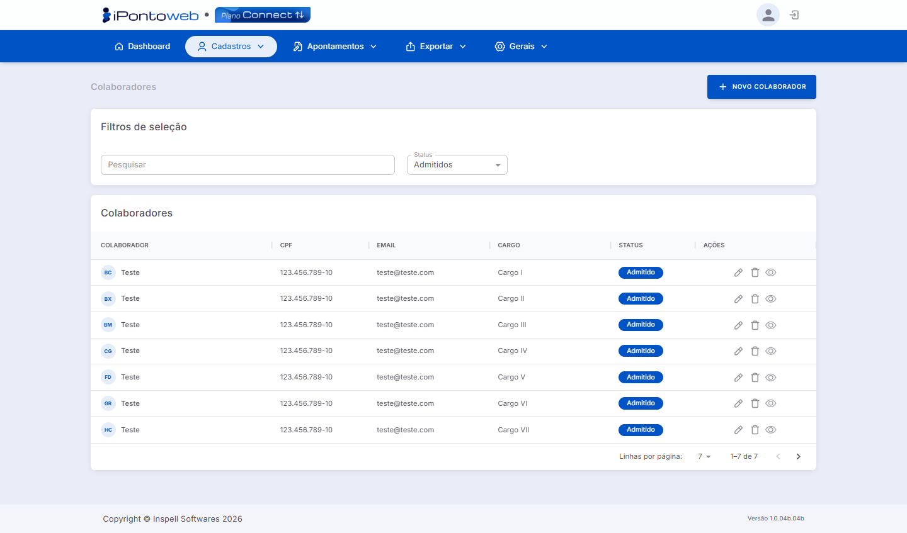

#  <b>Página de Colaboradores Cadastrados</b> 

---

## **Aplicação**

&nbsp;&nbsp;&nbsp;&nbsp;A <b>Página de Colaboradores</b> exibe a listagem de todos os <b>funcionários cadastrados</b> na plataforma, sejam admitidos, demitidos ou afastados, permitindo <b>visualizar</b>, <b>gerenciar</b> e realizar <b>ações</b> sobre cada registro.

---

## **Utilização**

&nbsp;&nbsp;&nbsp;&nbsp;A tela dispõe das seguintes **opções** para uso:

- *Botão* + Novo Colaborador ➡ Abre a tela de cadastro de um **novo colaborador**, permitindo **editar** suas informações e **adicioná-lo** ao sistema.
- *Filtros de Seleção:* Permite **filtar** os registros da tabela com base nos seguintes **métodos**:
    - *Campo Pesquisar:* Busca os registros na **tabela** com base no texto inserido no **campo**. Filtra apenas o conteúdo das colunas (**Nome** e **CPF**).
    - *Status:* Filtra a tabela com base no **status** atual do colaborador (**Todos**, **Afastados**, **Demitidos** e **Admitidos**.)
- *Tabela de Colaboradores Cadastrados:* Exibe, através de **6** colunas, informações **importantes** sobre cada **colaborador** registrado no sistema, além de um menu de **ações** para **gerenciar** cada cadastro:
    - *Nome:* Exibe o **nome** e a **foto** do colaborador, caso ela **tenha** sido incluída anteriormente.
    - *CPF:* Indica o número do documento de **CPF** do colaborador.
    - *EMAIL:* Mostra o **endereço de e-mail** cadastrado para o colaborador.
    - *Cargo:* Exibe o **cargo** atual do colaborador.
    - *Status:* Indica o atual **status** do colaborador, ou seja, se ele está Admitido, Demitido ou Afastado
    - *Ações:* Exibe um **grupo de ações** que são utilizadas para gerenciar cada cadastro:
        - 🖊 ➡ Abre a tela de **edição** do colaborador, permitindo alterar informações como **dados pessoais**, **vínculo com coletores**, **configurações móveis**, etc.
        - 🗑 ➡ Exclui **permanentemente** o registro do colaborador do sistema.
        - 👁 ➡ Abre o **cadastro** do colaborador em modo de **visualização**, ou seja, não permite alterar as informações, apenas vê-las. 

!!! danger "Atenção:"
    O sistema só permite **excluir colaboradores** que **NÂO** possuam **marcações de ponto** vinculadas a ele.

!!! note "Informações"
    O iPonto Web só contabiliza **Colaboradores Admitidos** para o Controle de Capacidade. Colaboradores **demitidos** ou **afastados** não são considerados.