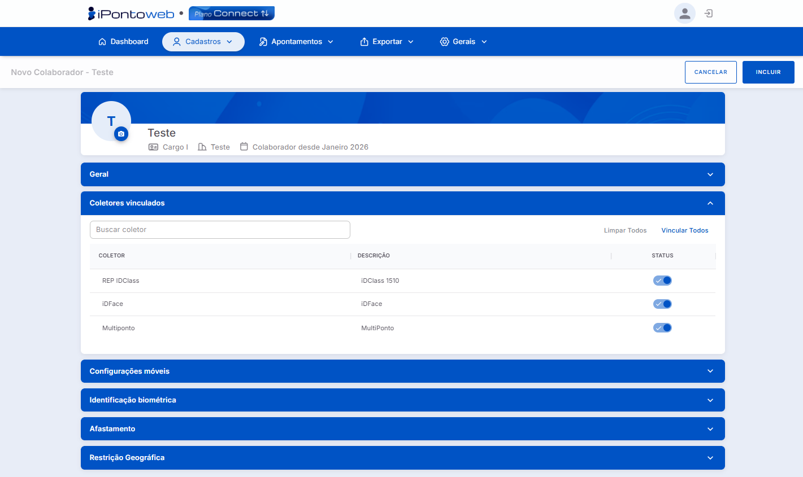
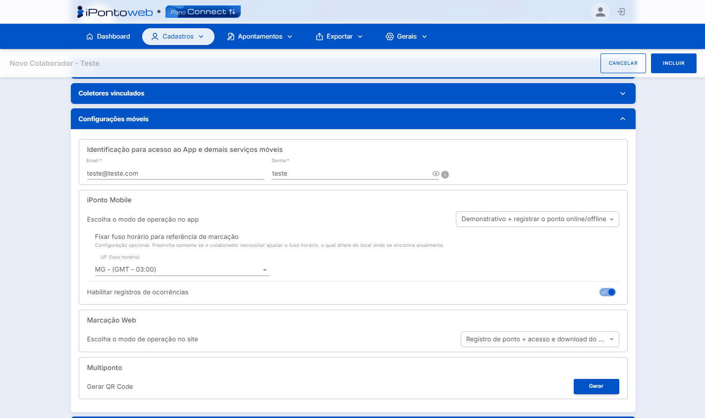
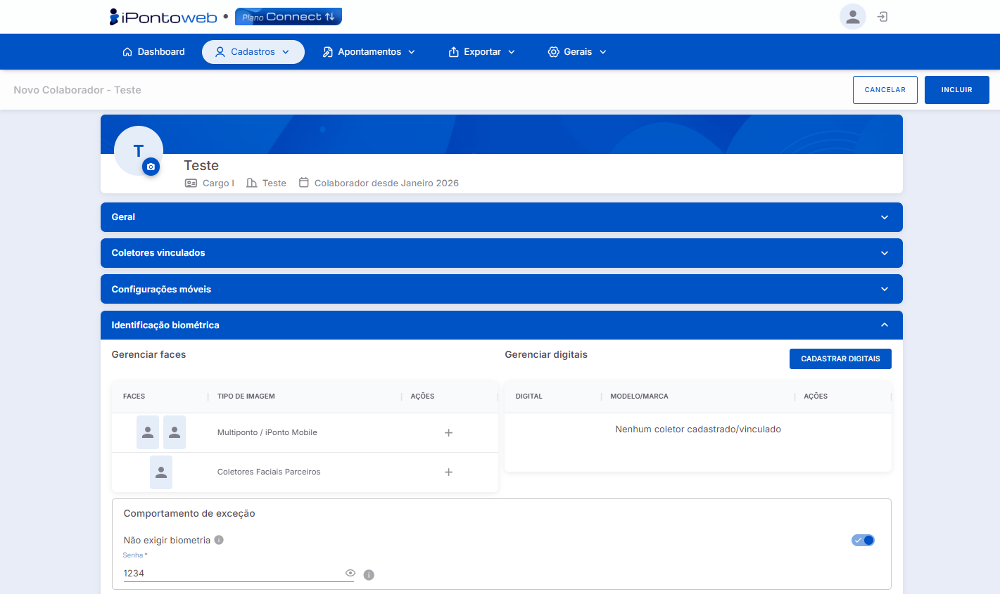
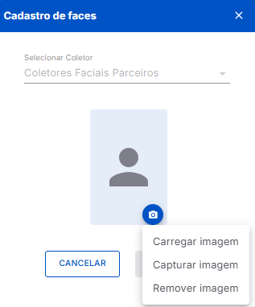
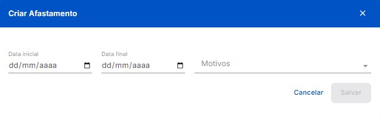
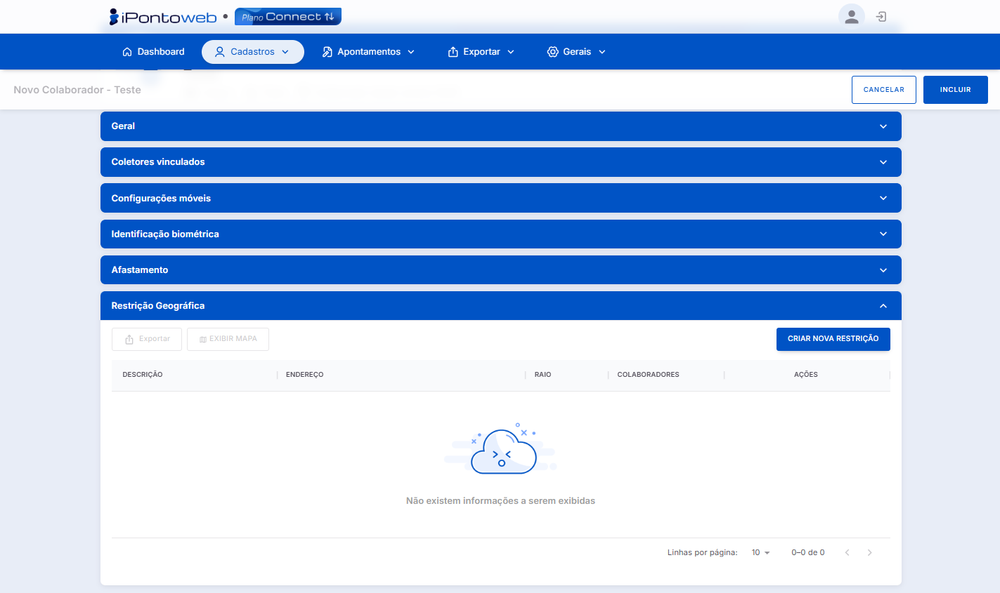
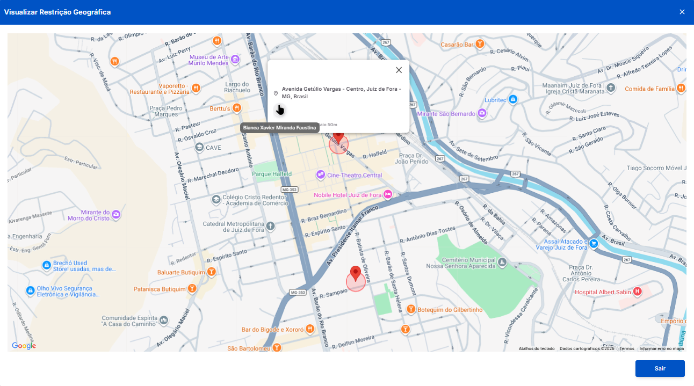
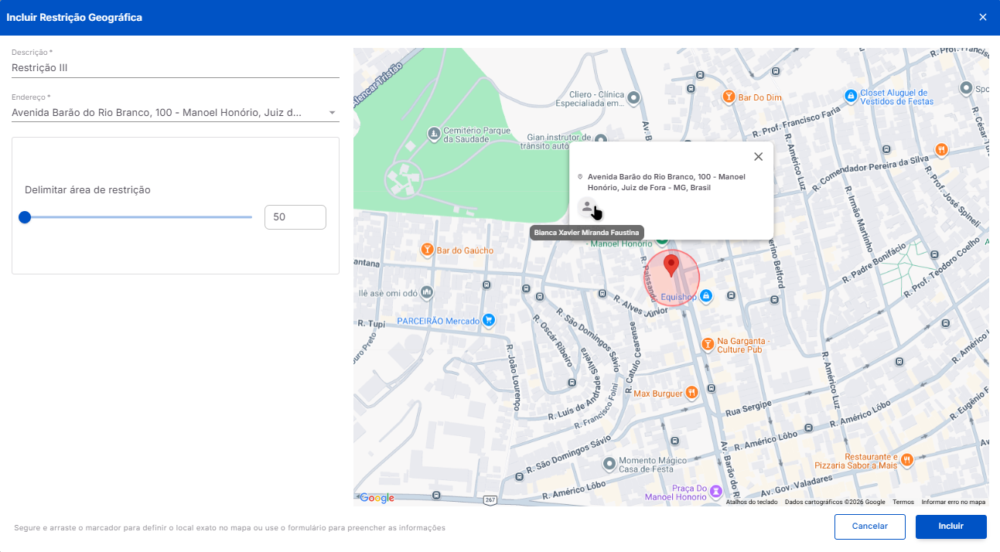

#  <b>Página de Cadastro de Colaborador</b> 

---

## **Aplicação**

&nbsp;&nbsp;&nbsp;&nbsp;A tela de cadastro é **acessada** ao clicar no botão + Novo Colaborador na página de consulta de colaboradores. O formulário de cadastro é dividido nas seguintes **seções expansíveis**, constituídas por diversos **parâmetros** de configuração.

## **Geral**

&nbsp;&nbsp;&nbsp;&nbsp;Contém os dados principais do colaborador, utilizados principalmente para **identificação**:

<figure markdown>
  
  <figcaption>Interface de Cadastro de Colaboradores - Seção Geral <b>(Clique Para Ampliar)</b></figcaption>
</figure>

- *Crachá:* Código de** identificação** do colaborador no sistema. (Obrigatório)
- *CPF:* Número do documento de **CPF**. (Obrigatório)
- *PIS:* Número de documento do **PIS**.
- *Nome:* Nome **completo** do colaborador. (Obrigatório)
- *Unidade de Negócio:* Unidade à qual o colaborador está **vinculado**. (Obrigatório)
- *Cartão de Proximidade:* Código do **cartão de proximidade** usado pelo colaborador no **equipamento de ponto**.
- *Identificador na Folha:* Código de referência para **integração** com sistemas de **folha de pagamento**.
- *Data de Admissão:* Data de **entrada** do colaborador na empresa. (Obrigatório)
- *Data de Demissão:* Data de **saída** do funcionário da empresa.
- *Cargo:* Cargo **atual** do colaborador.
    - + ➡ Botão para **criação rápida** de cargos. Após criado, o cargo á vinculado **automaticamente** ao colaborador.
- *Departamento:* Departamento **vinculado** ao funcionário.
    - + ➡ Botão para **criação rápida** de departamentos. Após criado, o departamento é vinculado **automaticamente** ao colaborador.
- *Setor:* Setor onde o funcionário está **lotado**.
    - + ➡ Botão para **criação rápida** de setores. Após criado, o setor é vinculado **automaticamente** ao colaborador.
- *Centro de Custo:* Centro de Custo **vinculado** ao colaborador.
    - + ➡ Botão para **criação rápida** de centros de custo. Após criado, o centro de custo é vinculado **automaticamente** ao colaborador.

---

## **Coletores Vinculados**

&nbsp;&nbsp;&nbsp;&nbsp;Permite associar os **equipamentos** cadastros no sistema ao colaborador, autorizando a **marcação de ponto** no dispositivo:

<figure markdown>
  
  <figcaption>Interface de Cadastro de Colaboradores - Seção Coletores Vinculados</figcaption>
</figure>

- *Campo de Pesquisa:* Busca os registros na **tabela** com base no texto inserido no **campo**. Filtra apenas o conteúdo das colunas (**Nome** e **Descrição**).
- *Botão Limpar Todos:* Desvincula o colaborador de **todos os coletores**.
- *Botão Vincular Todos:* Vincula **todos os coletores** das lista ao colaborador.
- *Tabela de Coletores Vinculados:* Exibe, através de **3** colunas, as informações básicas sobre cada **coletor** registrado no sistema:
    - *Coletor:* Indica o modelo do **coletor**, conforme consta em seu cadastro.
    - *Descrição:* Exibe a descrição do **coletor**, conforme consta em seu cadastro.
    - *Status:* Indica o status atual do vínculo entre o coletor e o colaborador:
        -  ➡ Coletor **vinculado** ao colaborador.
        -  ➡ Coletor **não vinculado** ao colaborador.

!!! note "Informações"
    A lista só exibe coletores que estejam **Ativos** no sistema, ou seja, no estado de **Em Operação**. Logo, equipamentos que foram **Inativados** na tela de cadastro de coletores **não serão** exibidos.

---

## **Configurações Móveis**

&nbsp;&nbsp;&nbsp;&nbsp;Define os parâmetros e configurações de **Acesso** e **Marcação** via **Dispositivos Móveis** e **Web**

<figure markdown>
  
  <figcaption>Interface de Cadastro de Colaboradores - Seção Configurações Móveis</figcaption>
</figure>

- *Seção Identificação para Acesso ao App e Demais Serviços Móveis:* Define as **crendenciais** que o colaborador utilizará para acessar os **serviços móveis** da Inspell (**Multiponto**, **iPonto Mobile**, etc.):
    - *E-mail:* Endereço de **e-mail** do colaborador, nos formatos (**nome@provedor.com**, **nome@provedor.com.br**, **nome@provedor.net**, etc.).
    - *Senha:* Credencial **segura** para acessar os serviços.
- *Seção iPonto Mobile:* Define **como** o colaborador realizará a marcação de ponto, através das seguintes **opções**:
    - *Escolha o modo de operação no app:* Define as **permissões** que o colaborador terá dentro do **Aplicativo Mobile**:
        - *Nenhuma Permissão Atribuída:* O colaborador não poderá realizar **nenhuma marcação de ponto** (**online** / **offline**), e nem acessar e / ou baixar os **demonstrativos de ponto**.
        - *Apenas acesso e download do demonstrativo:* O colaborador não pode realizar **marcações**, **online** ou **offine**, mas pode acessar e / ou baixar os **demonstrativos de ponto**.
        - *Demonstrativos + registrar o ponto online:* O funcionário pode realizar **apenas** marcações **online**, e também acessar e / ou baixar os **demonstrativos de ponto**.
        - *Demonstrativo + registrar o ponto online / offline:* **Acesso total**, ou seja, o funcionário pode realizar tanto marcações **online**, quanto marcações **offline**, além de acessar e / ou baixar os **demonstrativos de ponto**
    - *Fixar fuso horário para referência de marcação:* Atribui um **fuso horário fixo** para as marcações feitas nos **Aplicativos Móveis**. Útil quando o fuso horário do **local** onde o colaborador está **lotado** difere do utilizado pelo **APP**.
    - *Habilitar registro de ocorrências:* Permite, **quando habilitado**, que o colaborador faça o lançamento de **ocorrências** no **APP iPonto Mobile**. As ocorrências são **eventos relevantes** que não se caracterizam como **registros de ponto**.¹
    !!! danger "Atenção"
        1 -  Para que o **registro de ocorrências** seja corretamente habilitado, é preciso habilitar a opção global nas **configurações gerais** do sistema, através do caminho: menu **Gerais** ➡ opção **Configurações** ➡ aba **iPonto Mobile** ➡ seção **Controle de Ocorrências**.

---

## **Identificação Biométrica**

&nbsp;&nbsp;&nbsp;&nbsp;Gerencia os **dados biométricos** do colaborador para uso nos equipamentos de **marcação de ponto**:

<figure markdown>
  
  <figcaption>Interface de Cadastro de Colaboradores - Seção Identificação Biométrica</figcaption>
</figure>

- *Seção Gerenciar Faces*: Permite cadastrar as fotos do colaborador que serão utilizadas no **Multiponto**, **iPonto Mobile** e **Coletores Faciais Parceiros** para realizar as marcações de ponto. É composta de uma pequena **tabela**, com as seguintes **colunas**:
    - *Faces:* Exibe as **faces** cadastradas para o **colaborador** no sistema, e que serão utilizadas para a **identificação biométrica**. Caso não hajam faces, será exibida uma imagem **padrão** do sistema.
    - *Tipo de Imagem:* Indica onde que a **face cadastrada** será utilizada (**Multiponto**, **iPonto Mobile** ou **Coletores Faciais Parceiros**).
    - *Ações:* Disponibiliza **uma** ou **mais** ações que podem ser realizadas pelo usuário no gerenciamento das **faces**:
        - ➕ Exibido **somente** quando não há **nenhuma face** cadastrada na seção. Ao clicar, abre o modal de **cadastro de faces**, permitindo **adicionar** novas fotos.
        - 🖋 Exibido **somente** quando há, pelo menos, **uma** face cadastrada na seção. Ao clicar, abre o modal de **cadastro de faces**, permitindo **editar** as fotos já cadastradas.
        - 🗑 Exibido **somente** quando há, pelo menos, **uma** face cadastrada na seção. Ao clicar, abre um modal de **confirmação de exclusão**, permitindo **excluir** todas as fotos cadastradas na seção.
    - *Modal de Cadastro de Faces:* Permite acessar as opções para cadastro das fotos de identificação do colaborador:
        -  ➡ Abre um pequeno menu com três opções para o gerenciamento de faces:
            - *Carregar Imagem:* Permite fazer o **upload** de uma imagem diretamente do computador.
            - *Capturar Imagem:* Permite capturar a imagem em **tempo real**, através de algum dispositivo externo, como uma **webcam**, por exemplo.
            - *Remover Imagem:* Exclui a imagem **já cadastrada**.
      

        <figure markdown style="flex: 1;">
          
          <figcaption>Modal de Cadastro de Faces - Coletores Parceiros</figcaption>
        </figure>
        <figure markdown style="flex: 1;">
          .png)
          <figcaption>Modal de Cadastro de Faces - MultiPonto e iPonto Mobile</figcaption>
        </figure>
      

    !!! danger "Atenção"
        Caso a **imagem** da webcam não seja exibida na **página de captura**, certifique-se de que o dispositivo está **ligado** e corretamente **conectado** ao computador. Verifique também se o **navegador de internet** utilizado para acessar o **iPonto Web** está com permissão para acessar a **câmera**.

    !!! note "Informação"
        O sistema só permite **carregar imagens** com o formato **PNG** ou **JPG**, e que não excedam o tamanho máximo de **2MB**.

---

## **Afastamento**

&nbsp;&nbsp;&nbsp;&nbsp;Permite **registrar** e **gerenciar** períodos de **afastamento** do colaborador.

<figure markdown>
  
  <figcaption>Interface de Cadastro de Colaboradores - Seção Afastamento</figcaption>
</figure>

- *Tabela de Afastamentos:* Exibe, através de **6** colunas, todos os **afastamentos** cadastrados para o colaborador, estejam eles **vigentes** ou **não**:
    - *Data Inicial:* Exibe a **data exata**, no formato **DD/MM/AAAA**, em que o respectivo afastamento do colaborador iniciou(ará).
    - *Data Final:* Indica a **data exata**, no formato **DD/MM/AAAA**, em que o respectivo afastamento do colaborador finalizou(ará).
    - *Dias Afastados:* Exibe a quantidade **total** de dias que o colaborador permaneceu **afastado**.
    - *Motivo:* É a **justificativa** para o afastamento do colaborador.
    - *Data de Cadastro:* Indica Indica a **data exata**, no formato **DD/MM/AAAA**, em que o respectivo afastamento do colaborador foi cadastrado no sistema.
    - *Ações:* Contém um **grupo de opções** que permitem gerenciar o cadastro do afastamento:
        - 🖋 Abre o modal de **edição** do afastamento.
        - 🗑 Abre o modal de **confirmação de exclusão** do afastamento.

- *Botão* Criar ➡ Abre a tela de cadastro de um **novo afastamento**, permitindo **editar** suas informações e **adicioná-lo** ao sistema:

<figure markdown>
  
  <figcaption>Seção Afastamento - Modal de Cadastro</figcaption>
</figure>

  - *Data Inicial:* Indica a **data exata**, no formato **DD/MM/AAAA**, em que o respectivo afastamento do colaborador iniciou(ará).
  - *Data Final:* Indica a **data exata**, no formato **DD/MM/AAAA**, em que o respectivo afastamento do colaborador finalizou(ará).
  - *Motivos:* Lista com diversas **justificativas** que podem ser vinculadas ao afastamento.

---

## **Restrição Geográfica**

&nbsp;&nbsp;&nbsp;&nbsp;Define as **Restrições de Localização** para o registro de ponto do **colaborador**.

<figure markdown>
  
  <figcaption>Interface de Cadastro de Colaboradores - Seção Restrição Geográfica</figcaption>
</figure>

- *Tabela de Restrições Geográficas:* Exibe, através de **5** colunas, todos os **restrições** cadastradas para o colaborador:
    - *Descrição:* Descrição que **identifica** a restrição geográfica.
    - *Endereço:* Endereço **exato** do local que será **delimitado** pela restrição geográfica.
    - *Raio:* Indica qual o tamanho, em **metros**, da área ao entorno do **endereço** cadastrado que será **delimitada** para a marcação de ponto.
    - *Colaboradores:* Indica **quantos** colaboradores estão atualmente **vinculados** com essa restrição geográfica.
    - *Ações:* Exibe um **grupo de ações** que são utilizadas para gerenciar cada cadastro:
        - 🖊 ➡ Abre a tela de **edição** da restrição geográfica, permitindo alterar informações **cadastrais** e dados que afetam a sua **operação**.
        - 🗑 ➡ Exclui **permanentemente** a restrição do sistema, desvinculando-a do cadastro do respectivo colaborador.
        - 👁 ➡ Abre o **cadastro** da restrição geográfica em modo de **visualização**, ou seja, não permite alterar as informações, apenas vê-las. 

<!-- - *Botão Exportar:* Permite exportar, em um arquivo **.CSV**, todos os cadastros de **restrição geográfica** do colaborador.
- *Botão Exbir Mapa:* Permite visualizar o seguinte **mapa** com a localização de **todas** as **restrições** cadastradas para o colaborador:

<figure markdown>
  
  <figcaption>Interface de Cadastro de Colaboradores - Seção Restrição Geográfica</figcaption>
</figure>

!!! note "Informação"
    Ao clicar no **ícone da restrição** no mapa, será exibido o **endereço exato** que foi cadastrado, e também a **quantidade de colaboradores** vinculados à restrição. -->

- *Botão* CRIAR NOVA RESTRIÇÃO ➡ Abre a seguinte tela de cadastro de uma **nova restrição geográfica**, permitindo **incluir** suas informações e **adicioná-la** ao sistema:
    - *Descrição:* Descrição que **identifica** a restrição geográfica.
    - *Endereço:* Endereço **exato** do local que será **delimitado** pela restrição geográfica.
    - *Delimitar área de restrição:* Indica qual o tamanho, em **metros**, da área ao entorno do **endereço** cadastrado que será **delimitada** para a marcação de ponto.

<figure markdown>
  
  <figcaption>Interface de Cadastro de Colaboradores - Seção Restrição Geográfica</figcaption>
</figure>
