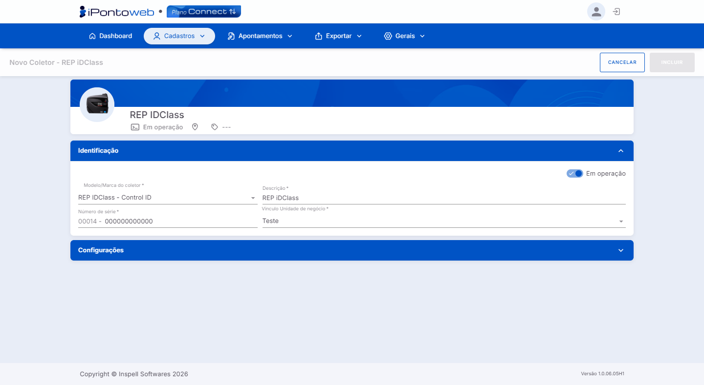
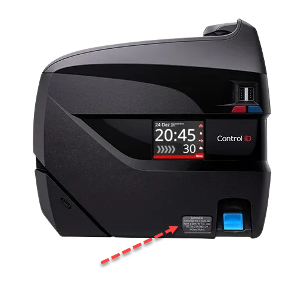
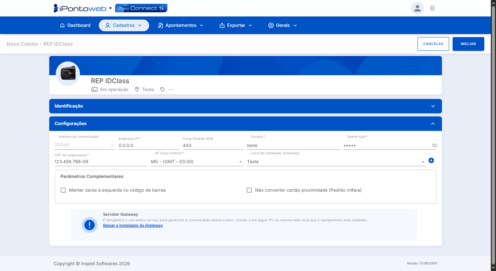

#  <b>Página de Cadastro de Coletor</b> 

---

## **Aplicação**

&nbsp;&nbsp;&nbsp;&nbsp;A tela de cadastro é **acessada** ao clicar no botão + Novo Coletor na página de consulta de coletores. O formulário de cadastro é dividido em duas **seções expansíveis** (**Identificação** e **Configuração**), constituídas por diversos **parâmetros** de configuração, os quais variam conforme o **modelo** e a **marca** do coletor.

---

## Control iD

- ### REP iDClass (373, 1510, 671 e 671 Facial):
    - ### Seção Identificação:

<figure markdown>
  
  <figcaption>Interface de Cadastro de Coletores iDClass - Seção Identificação</figcaption>
</figure>

- *Toogle de Ativação / Inativação:* Altera o **status atual** do coletor:
    -  ➡ Coletor **Ativo** / **Em Operação**.
    -  ➡ Coletor **Inativo** / **Fora de Operação**.
- *Descrição:* Exibe a descrição do **coletor**, conforme consta em seu cadastro.
- *Número de Série:* Número de **Fabricação** / **Série** do equipamento, utilizado para **identificação** e realização de **vínculo** através do **iGateway**. Comumente vem **anotado** na parte inferior **frontal** do coletor. 

- *Vínculo Unidade de Negócio:* Define à qual **unidade de negócio** o coletor será vinculado.

    - ### Seção Configuração:

<figure markdown>
  
  <figcaption>Interface de Cadastro de Coletores iDClass - Seção Configurações</figcaption>
</figure>

- *Interface de Comunicação:* Define qual **método de comunicação** será utilizado pelo equipamento para interligação com o **iGateway**. No caso dos **REP's iDClass**, a opção é fixa no valor "**TCP / IP**".
- *Endereço IP:* Endereço IP **fixo** do equipamento utilizado para **identificação** do coletor na rede e estabelecimento de **conexão**.

    !!! danger "Atenção"
        Certifique-se de que o seu **REP iDClass** não está com a configuração de **IP Dinâmico** (**DHCP**) ativada nas configurações internas do equipamento, pois isso pode ocasionar a **troca** automática do **Endereço IP**, impedindo a identificação do coletor pelo **iGateway**.

- *Porta:* Assim como o **Endereço IP**, é utilizada para estabelecimento de **conexão com o equipamento** na rede. No caso dos **REP's iDClass** a porta padrão é **443**.
- *Usuário:* Define o **nome de usuário** que será utilizado para acessar a **interface web** do equipamento.
- *Senha Login:* Define a **senha** que será utilizada, juntamente com o nome de usuário, para acessar a **interface web** do equipamento.
- *CPF do Responsável:* CPF da pessoa **responsável** pelo equipameto. É utilizado para vincular o **iGateway** à conta e permitir **identificar** o equipamento na rede.