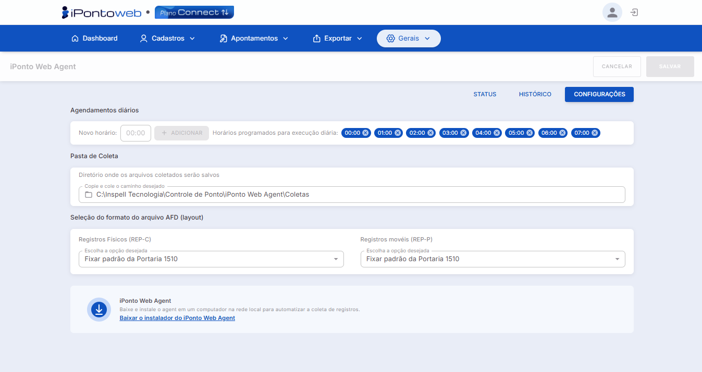
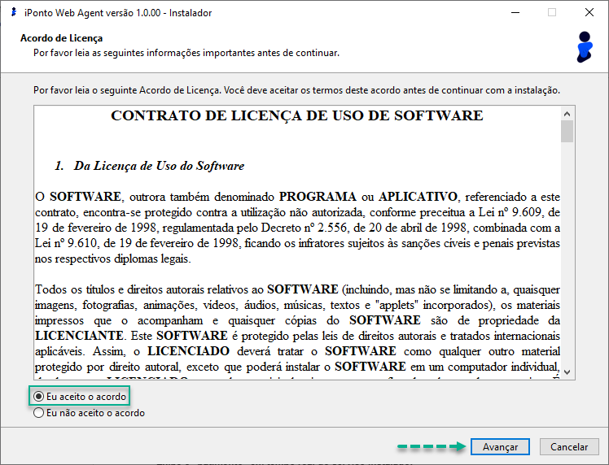
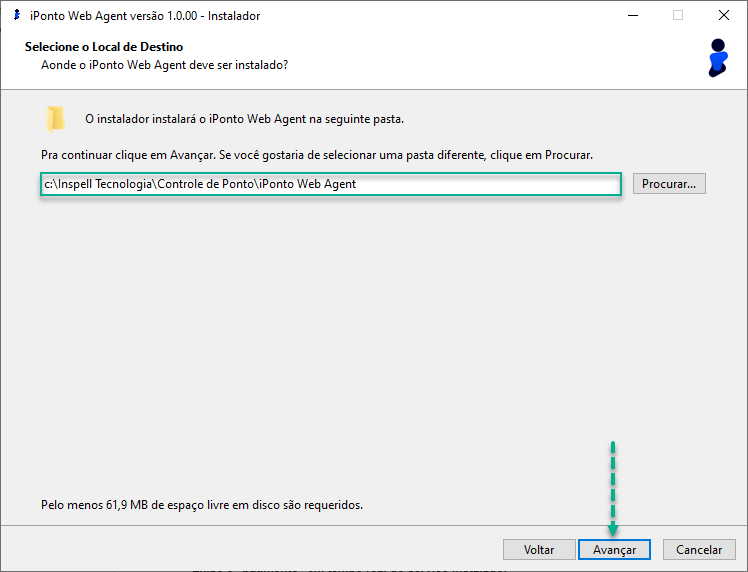
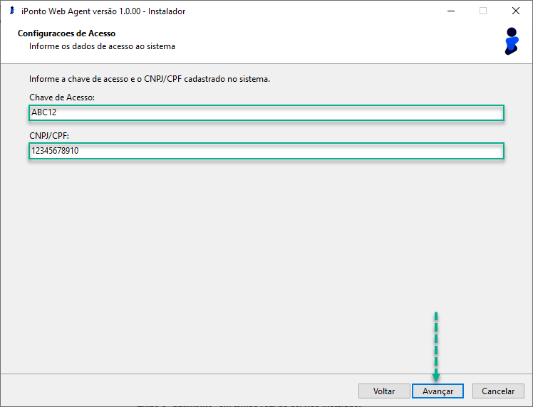
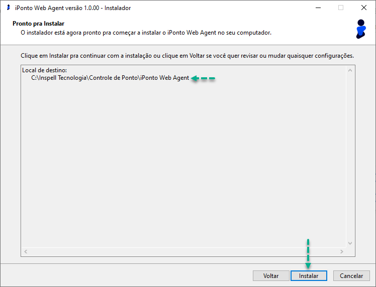
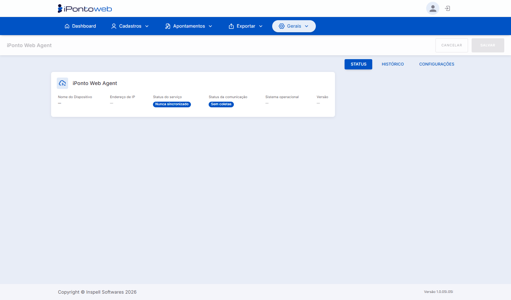
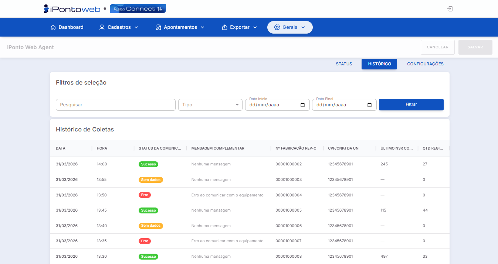

#  <b>iPonto Web Agent</b> 

---

## **Aplicação**

&nbsp;&nbsp;&nbsp;&nbsp;O iPonto Web Agent é um **serviço auxiliar**, instalado localmente em uma máquina **Windows**, apoiando o **iPonto Web Connect**, ao automatizar a **coleta** de registros de ponto (**ainda não lidos**) em arquivos AFD (**Não Fiscais**), originados em equipamentos **REP-P** ou **REP-C**, em uma pasta já configurada.

&nbsp;&nbsp;&nbsp;&nbsp;Embora utilize layouts baseados nas normas fiscais (**Portarias 1510** e **671**), os arquivos não são **compactados** nem **assinados digitalmente**, visando simplificar a **importação** e o **tratamento** desses dados em **Sistemas ERP's** ou **Folhas de Pagamento** parceiras.

&nbsp;&nbsp;&nbsp;&nbsp;Vale lembrar que os **Arquivos AFD** gerados pelo **iPW Agent**, por serem **Não Fiscais**, são constituídos apenas dos seguintes itens:

- **Cabeçalho** (Registro do Tipo **1**)
- **Marcações de Ponto** (Registros do Tipo **3** para **REP-C**, e do Tipo **7** para **REP-P**)
- **Trailer** (Registro do Tipo **9**).
 
&nbsp;&nbsp;&nbsp;&nbsp;Logo, todos os **demais eventos** (2, 4, 5 e 6), tais como os dados de **empresas** e **colaboradores**, não são incluídos no arquivo.

---

## **Requisitos**

- *Sistema Operacional:* Windows 8 **64 Bits** ou Windows Server 2008 R2 **64 Bits** (ou superior).
- *Conexão à Internet:* Acesso **liberado** e **irrestrito** ao endereço <b><a href="https://ipontoweb.com.br" target="_blank">ipontoweb.com.br</a></b> nas portas **80** e **443**.

---

## **Configuração**

&nbsp;&nbsp;&nbsp;&nbsp;Local onde se **define** o **comportamento** da coleta automatizada de registros. É acessado através do menu **Gerais** ➡ opção **iPonto Web Agent** ➡ aba **Configurações**.

!!! danger "Atenção:"
    - Para registrar **qualquer alteração**, lembre-se **sempre** de clicar no botão SALVAR para **confirmar** as mudanças.
    - As mudanças realizadas nessa tela não são imediatamente efetivadas e podem demorar até **30 minutos** para entrarem em vigor.

&nbsp;&nbsp;&nbsp;&nbsp;A tela dispõe dos **seguintes parâmetros**:

<figure markdown>

<figcaption>iPonto Web Agent - Aba de Configurações</figcaption>
</figure>

- *Agendamentos Diários:* Área em que se define os **horários** que o serviço iPW Agent realizará a(s) **coleta(s)** diária(s).
    - *Agendar um Horário:* Digite um **valor válido** no campo “**Novo Horário**” (**12:30**, por exemplo), e clique no botão + ADICIONAR para inseri-lo na lista.
    - *Excluir um Horário:* Clique no **X** (**ícone cinza**), mostrado ao lado direito do horário que deseja **remover** da lista, e ele será **excluído**.

    !!! note "Informações"
        - O sistema permite **agendar**, no máximo, **12 horários** para a realização das **coletas automatizadas**!
        - Ao atingir o **limite máximo** de horários agendados (**12**), o botão + ADICIONAR é imediatamente **desabilitado**!
        - A **primeira coleta** realizada pelo **serviço** sempre considerará **todos** os registros realizados desde a **00:00** do dia corrente!
        - As coletas **não** são realizadas diretamente no(s) **equipamento(s)**, e sim nos na lista de **registros apontados** no Banco de Dados.

- *Pasta de Coleta:* Determina o **caminho** onde os arquivos AFD **Não Fiscais** serão salvos.
    - *Trocar a Pasta:* Copie o **caminho desejado** e cole-o no campo  “**Diretório onde os arquivos coletados serão salvos**”. O serviço também suporta salvar as coletas em **caminhos de rede**, convencionais “**192.168.0.1\DP\Ponto**” ou mapeados “**S:\RH\Ponto**”, por exemplo.

    !!! danger "Atenção:"
        Garanta que o **usuário** da máquina, onde o serviço **iPonto Web Agent** foi instalado, tem **permissão completa** à pasta de coletas definida, seja ela **local** ou um **caminho de rede**.

- **Seleção do Formato do Arquivo (Layout):** Escolha qual **estrutura de arquivo** o sistema deverá utilizar para gerar os **arquivos AFD**.
    - *Registros Físicos (REP-C):* Registros originados **diretamente** nos equipamentos **REP Físicos**, que possuem **memória fiscal** própria e **impressora**.
        - *Opções de exportação disponíveis*:
            - *Seguir padrão do modelo do equipamento* [**Padrão**]: Segue exatamente o **formato original padrão** dos dispositivos. Se ele for do **Tipo 1510**, gerará o AFD no Padrão da **Portaria 1510**. Se for do **Tipo 671**, usará as definições da **Portaria 671**.
            - *Fixar padrão da portaria 1510:* independente do **modelo** ou **fabricante**, sempre gerará o arquivo no formato estrutural da **Portaria** **1510**.
            - *Fixar padrão da portaria 671:* independente do **modelo** ou **fabricante**, sempre gerará o arquivo no formato estrutural da **Portaria** **671**.

            !!! note "Informação"
                Independente do tipo de **identificador padrão** de cada portaria (**PIS** no caso da **1510**, ou **CPF**, no caso da **671**), a geração dos arquivos sempre usará o **identificador original** gravado na **marcação**.

        - Para ilustrar a **estrutura dos arquivos** gerados pelo sistema, geramos **exemplos** de cada portaria:
            - *Portaria 1510:* <b><a href="https://drive.google.com/file/d/1Kr4EMxxPQFEz9pOptcmjOMzk9jfQ33CZ/view?usp=drive_link" target="_blank">Clique Aqui Para Baixar</a>.</b>
            - *Portaria 671:* <b><a href="https://drive.google.com/file/d/14GD5gkCFMzglNFxbeMYT0wKHhi6FJ8vt/view?usp=sharing" target="_blank">Clique Aqui Para Baixar</a>.</b>

            !!! note "Informação"
                Para o modo **REP-C**, será gerado **1** (**um**) arquivo AFD por **equipamento**, para cada coleta agendada nos **horários programados**.

    - *Registros Móveis (REP-P):* Registros originados via aplicativos Inspell (**iPonto Mobile**, **Multiponto** ou **Site de Marcação Web**) ou **coletores parceiros** compatíveis com o iGateway.
        - *Opções de exportação disponíveis:*
            - *Fixar padrão da portaria 671* [**Padrão**]: independente do **modelo** ou **fabricante**, sempre gerará o arquivo no formato estrutural da **Portaria 671**.
            - *Fixar padrão da portaria 1510*: independente do **modelo** ou **fabricante**, sempre gerará o arquivo no formato estrutural da **Portaria 1510**.

            !!! note "Informação"
                Para **REP-P**, Independente do formato selecionado, o  identificador utilizado será sempre o **CPF**.

        - Para ilustrar a **estrutura dos arquivos** gerados pelo sistema, geramos **exemplos** de cada portaria:
          - *Portaria 671:* <b><a href="https://drive.google.com/file/d/10wnWddSETlyT7hfPrITb4sFB6rKo1yeI/view?usp=drive_link" target="_blank">Clique Aqui Para Baixar</a>.</b>
          - *Portaria 1510:* <b><a href="https://drive.google.com/file/d/1AZU28S3x7z6a00rFDXZoWf353aMXRNkU/view?usp=sharing" target="_blank">Clique Aqui Para Baixar</a>.</b>

            !!! note "Informação"
                Para o modo **REP-P**, será gerado **1** (**um**) arquivo **AFD** por **Unidade de Negócio** (identificada através do **CPF** ou **CNPJ**).

---

## **Instalação**

&nbsp;&nbsp;&nbsp;&nbsp;A versão **mais recente** do instalador pode ser baixada diretamente no link disponibilizado na aba **Configurações** do **iPonto Web Agent**, ou apenas <b><a href="https://inspell.com.br/downloads/iponto/iPontoWebAgent.exe" target="_blank">Clicando Aqui</a>.</b> Após ter o instalador **baixado** na máquina, basta seguir os **passos seguintes**:

- **Execute** o instalador, aceite o Contrato de Uso de Softwares e prossiga para a **página seguinte**:

<figure markdown>

<figcaption>Página de Aceite do Contrato - Instalador iPW Agent</figcaption>
</figure>

- Escolha o **local de instalação** desejado e avance para a tela **seguinte** (**OBS:** Recomendamos utilizar o **local de instalação padrão** definido pelo instalador):

<figure markdown>

<figcaption>Página de Definição do Diretório de Instalação - Instalador iPW Agent</figcaption>
</figure>

- Informe a **Chave de Acesso** e o **CNPJ** / **CPF** da **Unidade de Negócio Principal**, utilizados para realizar o **vínculo do serviço** com a conta.

<figure markdown>

<figcaption>Página de Configuração dos Dados de Acesso - Instalador iPW Agent</figcaption>
</figure>

!!! note "Informação"
    - A **Chave de Acesso** da conta pode ser encontrada no iPonto Web, no caminho (menu **Gerais** ➡ opção **Configurações** ➡ aba **Configurações Gerais**).
    - O **CPF** / **CNPJ** da **Unidade de Negócio Principal** pode ser encontrada no caminho (menu **Cadastros** ➡ opção **Unidade de Negócio** ➡ coluna **N° Identificador**)

- Na **próxima** tela, basta clicar no botão "**Instalar**" e aguardar o **término do processo**:

<figure markdown>

<figcaption>Página de Revisão - Instalador iPW Agent</figcaption>
</figure>

!!! danger "Atenção:"
    Após o **término da instalação**, a ativação do serviço na máquina local é **automática**, desde que não haja outro iPonto Agent vinculado à **mesma conta** em **outro PC**.

---

## **Operação e Monitoramento**

&nbsp;&nbsp;&nbsp;&nbsp;Todo o **processo de acompanhamento** do recurso é realizado diretamente na **interface do iPonto Web**, através do caminho (menu **Gerais** ➡ opção **iPonto Web Agent** ➡ aba **Staus** / **Histórico**):

  1. Aba **STATUS**:

<figure markdown>

<figcaption>Aba STATUS do iPW Agent</figcaption>
</figure>

  - *Nome do Dispositivo:* Identifica o computador onde o iPonto Web Agent está **instalado** e foi **vinculado** pela última vez.

    !!! danger "Atenção:"
        O serviço do **iPW Agent** só pode ser vinculado à **1** (**uma**) conta por vez. Caso seja necessário **trocar** a máquina, procure o seu **revendedor autorizado**.

  - *Endereço de IP:* IP **local** da máquina que estava **vinculada** com o serviço do **iPW Agent** na última sincronização (pode **mudar** caso o **IP** esteja configurado como **Dinâmico** / **DHCP**).

  - *Status do Serviço:* Indica o **estado atual** do serviço do iPW Agent, e a data e hora da **última sincronização automática**. Esse processo verifica o **funcionamento do serviço** e **atualiza suas configurações** (novos **horários de coleta** ou troca de **pasta de armazenamento**, por exemplo):

      - Nunca Sincronizado ➡ Indica que o **serviço** do iPonto Web Agent ainda não foi **instalado** ou **vinculado** à conta.  

      - Online ➡ Indique a última **ação** foi correatmente realizada em menos de **24 horas**.

      - Hibernando ➡ Indica que a última ação foi corretamente realizada entre **24** e **72** horas, mas não precisa de uma intervenção imediata.

      - Offline ➡ Indica que a última ação foi realizada a mais de **72** horas. Essencial acionar o **TI** ou o **Revendedor** para avaliar o motivo do status.

        !!! danger "Atenção:"
            Caso o status de **Offline** persista, verifique se os **horários** para a realização da **coleta automatizada** estão corretamente definidos e **salvos** na área de **configurações** do **iPW Agent**.

  - *Status da Comunicação:* Indica o **estado** e a **data** e **hora** da **última comunicação** realizada pelo **iPW Agent**. Esse processo é responsável por coletar as **marcações de ponto** nos horários agendados, e exportar o arquivo **AFD** para a **pasta de destino** configurada:

      - Sem coletas ➡ Indica que, ou o **serviço** do iPW **Agent** ainda não foi **instalado** na máquina ou **vinculado** à conta, ou que nenhuma **coleta** agendada ainda foi realizada. 

      - Sem dados ➡ Indica que a **comunicação** / **tentativa de coleta** foi corretamente realizada, mas nenhuma nova marcação (registro ainda **não lido**) foi encontrada para coleta. Nesse caso, nenhum **Arquivo AFD** é gerado.

      - Sucesso ➡ Indica que a **comunicação** / **tentativa de coleta** foi corretamente realizada, e no mínimo, **1** (**uma**) nova marcação foi encontrada, **coletada** e exportada no Arquivo **AFD** para o diretório definido nas **configurações** do **iPW Agent**.

      - Erro ➡ Indica alguma **intercorrência** durante a **comunicação** / **tentativa de coleta**, e neste caso, nenhuma **nova marcação** é exportada. Recomenda-se acionar **imediatamente** o **TI** da sua empresa ou o **Revendedor Autorizado** para diagnosticar o motivo do erro.

  - *Sistema Operacional:* Exibe a **versão** / **edição** do sistema operacional **instalado** da máquina onde o serviço está sendo executado. Assim como o **Endereço IP**, é útil para detectar, em grandes **ambientes corporativos**, qual máquina está rodando o **iPW Agent**.

  - *Versão:* Identifica e mostra a **versão atual** do serviço do iPonto Web Agent que está sendo **executado** na máquina local. Útil como **informação técnica** para **suportes remotos**, e para **identificação** de versões antigas que podem ser **atualizadas**.

---

  1. Aba **HISTÓRICO**:

&nbsp;&nbsp;&nbsp;&nbsp;Permite **auditar** todas as **coletas** realizadas, através dos seguintes **componentes** na tela:

<figure markdown>

<figcaption>Aba HISTÓRICO do iPW Agent</figcaption>
</figure>

  - *Filtros de Seleção:* Permite **filtrar** os registros da tabela de **histórico de coletas** através dos seguintes **métodos**:
  - 
      - *Campo Pesquisar:* Busca os registros na **tabela** com **base** no texto inserido no campo. Filtra apenas o conteúdo das colunas: **Mensagem Complementar**, **N° Fabricação REP-C**, **CPF** / **CNPJ** da **UN** e **Último NSR Coletado**.
  
      - *Tipo:* Filtra a **tabela** com base no **tipo** de registro que foi **coletado** (Registros de **REP-C** ou **REP-P**).
   
      - *Data Início e Data Final:* Permite listar as coletas realizadas com base em um **período delimitado**. Filtra **especificamente** a coluna Data.
  
  - *Tabela de Histórico de Coletas:* Exibe, através de **8 colunas**, informações importantes sobre todas as **comunicações** / **tentativas de coleta** realizadas pelo serviço do **iPW Agent**, facilitando possíveis **diagnósticos de erros** ou **inconsistências**:

      - *Data:* Indicação, no formato **DD/MM/AAAA** (ex.: **01/01/2026**), da data exata da **comunicação** / **tentativa de coleta**.

      - *Hora:* Indicação, no formato **HH:MM** (ex.: **15:45**), da hora exata da **comunicação** / **tentativa de coleta**.

  - *Status da Comunicação:* Indica o **estado** e a **data** e **hora** da **comunicação** / **tentativa de coleta**. Esse processo é responsável por coletar as **marcações de ponto** nos horários agendados, e exportar o arquivo **AFD** para a **pasta de destino** configurada:

      - Sem coletas ➡ Indica que, ou o **serviço** do iPW **Agent** ainda não foi **instalado** na máquina ou **vinculado** à conta, ou que nenhuma **coleta** agendada ainda foi realizada. 

      - Sem dados ➡ Indica que a **comunicação** / **tentativa de coleta** foi corretamente realizada, mas nenhuma nova marcação (registro ainda **não lido**) foi encontrada para coleta.

      - Sucesso ➡ Indica que a **comunicação** / **tentativa de coleta** foi corretamente realizada, e no mínimo, **1** (**uma**) nova marcação foi encontrada, **coletada** e exportada no Arquivo **AFD** para o diretório definido nas **configurações** do **iPW Agent**.

      - Erro ➡ Indica alguma **intercorrência** durante a **comunicação** / **tentativa de coleta**, e neste caso, nenhuma **nova marcação** é exportada. Recomenda-se acionar **imediatamente** o **TI** da sua empresa ou o **Revendedor Autorizado** para diagnosticar o motivo do erro.

  - *Mensagem Complementar:* Informação que **complementa** o **status da comunicação**, exibida **apenas** quando ocorre um **erro** na **tentativa de coleta**. Mostra uma descrição resumida da **possível** causa do erro, auxiliando no processo de **diagnóstico** (Ex.: **HTTP 403 - Acesso Negado**).

  - *N° Fabricação REP-C:* Aplicável quando ocorre a **coleta** de marcações originadas de Equipamentos **REP-C Físicos**, tanto **1510**, quanto **671**. Em caso de coleta de registros do tipo **REP-P**, o campo é preenchido com “**---**”.

  - *CPF / CNPJ da UN:* Aplicável à todas as **comunicações** que retornaram o **status** de **Sucesso**, ou seja, que coletaram, no mínimo, **1** (**uma**) marcação. Indica qual o identificador (**CPF** ou **CNPJ**) da **Unidade de Negócio** referente às marcações coletadas, sejam elas de **REP-P** ou **REP-C**.

  - *Último NSR Coletado:* Exibe o **Número Sequencial de Registro** da última marcação coletada no processo de **comunicação**. Válido tanto para marcações **REP-C** quanto **REP-P**.

  - *QTD Registros:* Indica a **quantidade total** de registros coletados **com êxito** durante a **comunicação**.

---