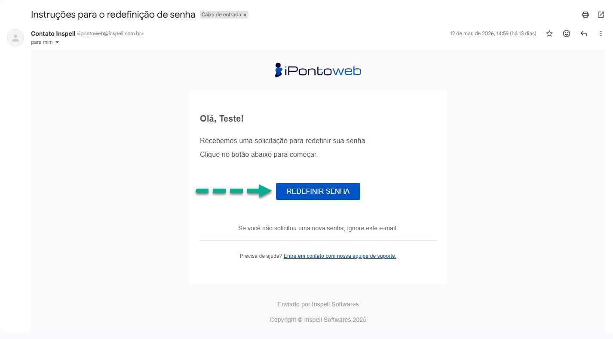

#  <b>Recuperando a Senha de Acesso</b> 

Para recuperar a sua senha de acesso à plataforma, basta seguir os passos abaixo:

**Passo 1 - Acessar a Tela de Recuperação de Senha**  
    Acesse a página de login do iPonto Web **<a href="https://ipontoweb.vercel.app/login/" target="_blank">Clicando Aqui</a>**. Feito isso, clique no botão "**Esqueci a Senha**", o qual te redicionará para a tela de recuperação de senha.
    

---

**Passo 2 - Enviar o Link de Recuperação**  
    No formulário exibido na tela, insira o **e-mail** utilzado durante o **processo de cadastro**, e então clique no botão "**Enviar Link**", para encaminhar, ao e-mail inserido, o **link de recuperação da senha**.
    

!!! danger "Atenção"
    - Caso o **e-mail** utilizado durante o processo de registro seja **inválido**, ou esteja **incorreto**, impedindo o envio do **link de recuperação**, procure a nossa **equipe de suporte** para realizar a troca!

---

**Passo 3 - Acessar o E-mail Enviado**  
    Após realizar o processo de envio do **link de recuperação**, acesse na caixa de entrada do seu e-mail, a **mensagem enviada pelo sistema**, e então clique no botão "**Redefinir Senha**" para iniciar o processo de **troca da sua senha**.
    

---

**Passo 4 - Alterar a senha**  
    Na nova tela que se abrirá em seu navegador, insira, no **formulário exibido**, a nova senha que que será utilizada para **acessar o sistema**, atentando-se para escolher uma **senha segura** e **fácil de lembrar**. Em seguida, clique no botão "**Gravar Senha**", e o sistema irá te **redirecionar automaticamente** para a página de login, onde você poderá usar sua **nova senha** para acessar a plataforma.
    