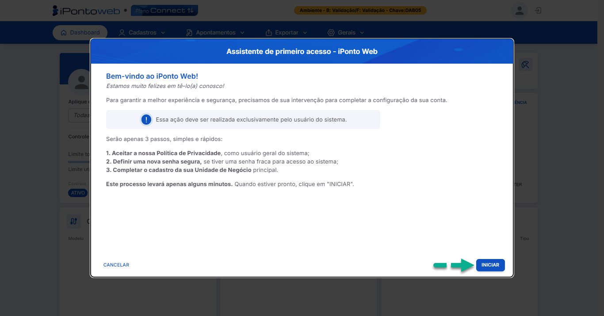
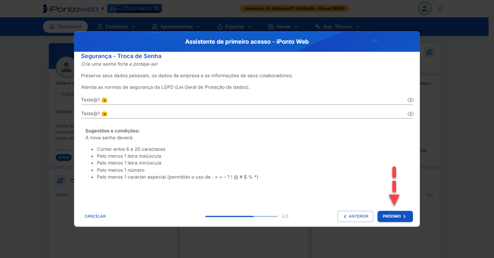

#  <b>Realizando o Primeiro Acesso à Plataforma</b> 

Para realizar o <b>processo de registro</b> da conta no sistema, basta seguir os <b>seguintes passos</b> abaixo:

**Passo 1 - Acessar a Tela de Registro do Sistema**  
    Acesse o link oficial de cadastro ao iPonto Web **<a href="https://ipontoweb.com.br/registro/." target="_blank">Clicando Aqui</a>**, lembrando de ter em mãos o e-mail de boas-vindas enviado pela nossa equipe, pois ele contém as informações necessárias para validar sua conta. 
    

---

**Passo 2 - Preencher o Formulário de Registro**  
    No formulário de registro, insira as informações solicitadas (**Chave de Acesso**, **CPF/CNPJ** e **E-mail**) conforme constam nos dados recebidos por e-mail. Para a senha, lembre-se de escolher uma senha segura, de sua preferência. Com os campos preenchidos, basta clicar no botão "**Confirmar e Acessar**" para continuar com o processo de registro. 
    

---

**Passo 3 - Acessando o Sistema**  
    Após clicar em "**Confirmar e Acessar**", o sistema processará suas informações. Uma vez concluído com sucesso, você será redirecionado automaticamente para a tela de boas-vindas do sistema, que mostrará um resumo dos próximos passos do assistente de primeiro acesso. 
    Para continuar com o processo de registro, clique no botão "**Iniciar**"
    

---

**Passo 4 - Aceite da Política de Privacidade**  
    Nessa tela, você poderá ler e enteder o conteúdo da nossa política, e compreender como iremos manipular com segurança as suas informações.  
    Para aceitar os termos, basta marcar o checkbox da opção "**Li, aceito e estou ciente do conteúdo desta política**" e clicar no botão "**Próximo**" para prosseguir com o processo de registro.
    

---

**Passo 5 - Troca de Senha (Se Necessário)**  
    Caso a senha definida no momento do cadastro não seja **segura o suficiente**, o sistema exibirá uma página solicitando a criação de uma **nova senha** para proteger suas informações.
    Crie uma nova senha seguindo as orientações de segurança fornecidas na tela e então clique no botão "**Próximo**" para prosseguir para a última etapa do processo de regsitro. 
    

---

**Passo 6 - Cadastro da Unidade de Negócio Principal**  
    Insira no formulário exibido na tela os dados referentes à **Unidade de Negócio**, preenchendo-o corretamente com as devidas informações, se atentando aos **campos obrigatórios**.
    Por fim, clique no botão "**Concluir**", e o sistema te redicionará automaticamente para o **Painel Inicial da Plataforma**, finalizando assim, o seu processo de registro. 
    

---

!!! note "Observações Importantes"
    - Caso você decida **interromper o processo de registro** durante o assistente de primeiro acesso, não se preocupe, você pode **retomá-lo a qualquer momento**, *logando* novamente no sistema.
    - Caso você encontre **algum problema** durante o processo, não hesite em **buscar ajuda** com a nossa **equipe de suporte!**