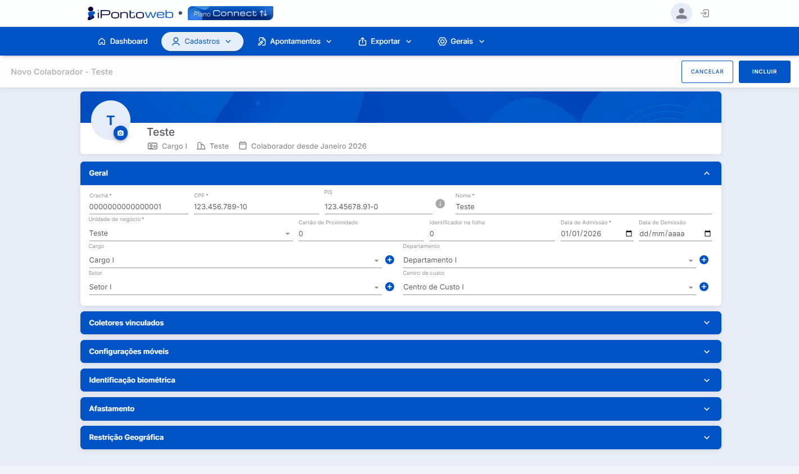
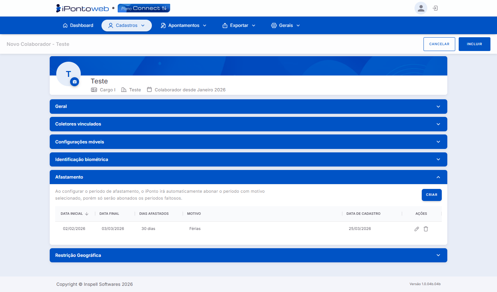

#  <b>Tela de Cadastro de Colaborador</b> 

A tela de cadastro é acessada ao clicar em **+ Novo Colaborador** ou no **ícone de edição** de um colaborador existente. O formulário é organizado nas seguintes **seções expansíveis**, que permitem realizar **diversas confugrações**:

## **Geral** 
### Contém os Dados Principais do Colaborador

<table class="tabela-config">
  <thead>
    <tr>
      <th>Campo</th>
      <th>Descrição</th>
    </tr>
  </thead>

  <tbody>
    <tr>  
      <td>Crachá (Obrigatório)</td>
      <td>Código de identificação do colaborador no sistema.</td>
    </tr>
    <tr>  
      <td>CPF (Obrigatório)</td>
      <td>Número do CPF do Colaborador</td>
    </tr>
    <tr>  
      <td>PIS (Obrigatório)</td>
      <td>Número do PIS do Funcionário</td>
    </tr>
    <tr>  
      <td>Nome (Obrigatório)</td>
      <td>Nome Completo do Colaborador</td>
    </tr>
    <tr>  
      <td>Unidade de Negócio (Obrigatório)</td>
      <td>Unidade à qual o colaborador está vinculado.</td>
        </tr>
    <tr>
      <td>Cartão de Proximidade</td>
      <td>Código do cartão de proximidade utilizado no equipamento.</td>
    </tr>
    <tr>
      <td>Identificador na Folha</td>
      <td>Código de referência para integração com a folha de pagamento.</td>
    </tr>
    <tr>
      <td>Data de Admissão (Obrigatório)</td>
      <td>Data de entrada do colaborador na empresa.</td>
    </tr>
    <tr>
      <td>Data de Demissão</td>
      <td>Data de saída, quando aplicável.</td>
    </tr>
    <tr>
      <td>Cargo</td>
      <td>Cargo do colaborador, com opção de criação rápida pelo botão (+).</td>
    </tr>
    <tr>
      <td>Departamento</td>
      <td>Departamento vinculado, com opção de criação rápida pelo botão (+).</td>
    </tr>
    <tr>
      <td>Setor</td>
      <td>Setor vinculado, com opção de criação rápida pelo botão (+).</td>
    </tr>
    <tr>
      <td>Centro de Custo</td>
      <td>Centro de custo vinculado, com opção de criação rápida pelo botão (+).</td>
    </tr>
  </tbody>
</table>

<figure markdown>
  
  <figcaption>Tela Correspondente às Configurações Listadas (Clique Para Ampliar)</figcaption>
</figure>

---

## **Coletores Vinculados** 
### Associar os Equipamentos de Ponto ao Colaborador

<table class="tabela-config">
  <thead>
    <tr>
      <th>Campo</th>
      <th>Descrição</th>
    </tr>
  </thead>

  <tbody>
    <tr>  
      <td>Buscar Coletor</td>
      <td>Campo de busca para localizar um coletor específico</td>
    </tr>
    <tr>  
      <td>Vincular Todos</td>
      <td>Associa todos os coletores disponíveis ao colaborador de uma só vez</td>
        </tr>
    <tr>
      <td>Limpar Todos</td>
      <td>Remove todos os vínculos existentes</td>
    </tr>
  </tbody>
</table>

<figure markdown>
  
  <figcaption>Tela Correspondente às Configurações Listadas (Clique Para Ampliar)</figcaption>
</figure>

---

## **Configurações Móveis** 
### Define as Configurações de Acesso e Marcação Via Dispositivos Móveis e Web

<table class="tabela-config">
  <thead>
    <tr>
      <th>Campo</th>
      <th>Descrição</th>
    </tr>
  </thead>

  <tbody>
    <tr class="secao">
      <td colspan="2">Identificação para Acesso ao App</td>
    </tr>
    <tr>
      <td>E-mail (Obrigatório)¹</td>
      <td>E-mail de acesso ao aplicativo</td>
    </tr>
    <tr>
      <td>Senha (Obrigatório)¹</td>
      <td>Senha de acesso ao aplicativo</td>
    </tr>
    <tr class="secao">
      <td colspan="2">iPonto Mobile</td>
    </tr>
    <tr>
      <td>Modo de Operação no App</td>
      <td>Define como o colaborador registra o ponto</td>
    </tr>
    <tr>
      <td>Fixar Fuso Horário</td>
      <td>Configuração opcional para colaboradores em fuso horário diferente</td>
    </tr>
    <tr>
      <td>Habilitar Registros de Ocorrências</td>
      <td>Permite o registro de ocorrências pelo app</td>
    </tr>
    <tr class="secao">
      <td colspan="2">Marcação Web</td>
    </tr>
    <tr>
      <td>Modo de Operação no Site</td>
      <td>Define o comportamento da marcação via navegador</td>
    </tr>
    <tr class="secao">
      <td colspan="2">Multiponto</td>
    </tr>
    <tr>
      <td>Gerar QR Code</td>
      <td>Botão para geração do QR Code no APP MultiPonto</td>
    </tr>
  </tbody>
</table>

<figure markdown>
  
  <figcaption>Tela Correspondente às Configurações Listadas (Clique Para Ampliar)</figcaption>
</figure>

!!! warning "Atenção"
    - (Obrigatório)¹: O campo é obrigatório apenas quando a opção "**Modo de Operação do App**" estiver habilitada.

---

## **Identificação Biométrica**
### Gerencia os dados biométricos do colaborador

<table class="tabela-config">
  <thead>
    <tr>
      <th>Campo</th>
      <th>Descrição</th>
    </tr>
  </thead>
  <tbody>
    <tr class="secao">
      <td colspan="2">Gerenciar Faces</td>
    </tr>
    <tr>
      <td>MultiPonto / iPonto Mobile</td>
      <td>Cadastro de foto facial para uso no APP e Multiponto.</td>
    </tr>
        <tr>
      <td>Coletores Faciais Parceiros</td>
      <td>Cadastro de foto facial para equipamentos parceiros</td>
    </tr>
    <tr class="secao">
      <td colspan="2">Comportamento de Exceção</td>
    </tr>
    <tr>
      <td>Não Exigir Biometria (Obrigatório)²</td>
      <td>Permite registrar o ponto sem biometria, utilizando uma senha alternativa</td>
    </tr>
  </tbody>
</table>

<figure markdown>
  
  <figcaption>Tela Correspondente às Configurações Listadas (Clique Para Ampliar)</figcaption>
</figure>

!!! warning "Atenção"
    - (Obrigatório)²: O campo é obrigatório apenas quando a opção "**Não Exigir Biometria**" estiver habilitada.

---

## **Afastamento**
### Permite Registrar e Gerenciar Períodos de Afastamento do Colaborador

<table class="tabela-config">
  <thead>
    <tr>
      <th>Campo</th>
      <th>Descrição</th>
    </tr>
  </thead>

  <tbody>
    <tr>  
      <td>Criar</td>
      <td>Botão Para Registrar um Novo Afastamento</td>
    </tr>
  </tbody>
</table>

<figure markdown>
  
  <figcaption>Tela Correspondente às Configurações Listadas (Clique Para Ampliar)</figcaption>
</figure>

---

## **Restrição Geográfica**
### Define as Restrições de Localização Para o Registro de Ponto do Colaborador

<table class="tabela-config">
  <thead>
    <tr>
      <th>Campo</th>
      <th>Descrição</th>
    </tr>
  </thead>

  <tbody>
    <tr>  
      <td>Criar Nova Restrição</td>
      <td>Botão para cadastrar uma nova área permitida</td>
    </tr>
    <tr>  
      <td>Exportar</td>
      <td>Exporta a lista de restrições</td>
    </tr>
    <tr>  
      <td>Exibir Mapa</td>
      <td>Visualiza as restrições cadastradas em um mapa</td>
    </tr>
  </tbody>
</table>

<figure markdown>
  
  <figcaption>Tela Correspondente às Configurações Listadas (Clique Para Ampliar)</figcaption>
</figure>

